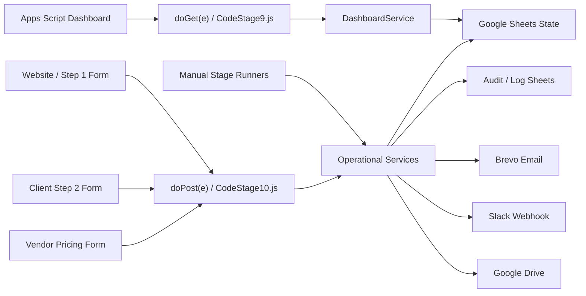

# MIDTS Automation Engine - System Topology Map

Status: Stage 4 documentation-only operational intelligence. This document does not authorize Apps Script edits, file moves, renames, refactors, webhook changes, sheet changes, deployment changes, or functional changes.

Source baseline:

- `docs/00_RESTRUCTURE_MAP.md`
- `docs/00-core-framework/01_DEPENDENCY_LOCK_MAP.md`
- `docs/00-core-framework/02_RISK_REGISTER.md`
- `docs/00-core-framework/03_OPERATING_MANUAL.md`
- `docs/00-core-framework/04_STAGE_RULES.md`

## Topology Summary

The MIDTS Automation Engine is a sheet-backed Apps Script automation system with three public ingress surfaces, several manual/runner validation surfaces, one dashboard surface, and multiple external integrations.

At a high level:

## System Classification

| Classification | Systems | Purpose |
|---|---|---|
| Core operational systems | `LeadService`, `WebsiteWebhookService`, `Step2RequirementService`, `VendorService`, `VendorPricingService`, `QuoteService`, `ProjectService`, `PaymentService`, `DriveService` | Own lead-to-project lifecycle behavior and state transitions |
| Governance systems | `ErrorLogger`, webhook log functions, service log sheets, `DashboardService`, framework docs | Preserve operational visibility, failure traceability, and change control |
| Communication systems | `EmailService`, `SlackService`, Brevo, Slack webhook | Send client/vendor/internal communications and record communication audit trails |
| Persistence systems | `DatabaseService`, Google Sheets tabs, `ConfigService`, `UtilsService`, `ID Counters` | Store state, config, identifiers, lifecycle records, and logs |
| Intelligence-ready systems | `DashboardService`, lead score fields, quote/vendor pricing records, audit logs | Current read/metric surfaces that can support future analytics or AI governance |
| External integration systems | Public website forms, Apps Script Web App, Brevo API, Slack webhook, Google Drive, Google Sheets | External interfaces and platform dependencies |

## Major Services

| Service | Classification | Upstream systems | Downstream systems | Role type | Primary state |
|---|---|---|---|---|---|
| `WebsiteWebhookService` | Core operational / governance | Website Step 1 form, `doPost(e)` | `LeadService`, `DatabaseService`, `Website Webhook Logs`, `ErrorLogger` | Orchestration plus state mutation | `Leads`, `Website Webhook Logs` |
| `Step2RequirementService` | Core operational / qualification | Step 2 form, `doPost(e)` | `LeadService`, `DatabaseService`, `Step 2 Requirement Logs`, `ErrorLogger` | Orchestration plus state mutation | `Leads`, `Step 2 Requirement Logs` |
| `VendorPricingService` | Core operational / vendor pricing | Vendor pricing form, `doPost(e)`, vendor pricing runners | `Vendor Pricing`, `Vendor Pricing Logs`, `QuoteService`, `ErrorLogger` | Orchestration plus state mutation | `Vendor Pricing`, `Vendor Pricing Logs` |
| `LeadService` | Core operational | Website webhook, dashboard, Step 2, quote/project/vendor services | `Leads`, `QuoteService`, `ProjectService`, `VendorService` | State mutation plus gatekeeping | `Leads` |
| `VendorService` | Core operational | Stage 4/4.5 runners, project/vendor pricing workflows | `Vendors`, `EmailService`, `DriveService`, `LeadService` | Gatekeeping plus orchestration | `Vendors`, `Leads` |
| `QuoteService` | Core operational | Quote runners, vendor pricing approval, lead readiness | `Quotes`, `ProjectService`, `PaymentService` | State mutation plus gatekeeping | `Quotes` |
| `ProjectService` | Core operational | Project runner, accepted quote, qualified lead, eligible vendor | `Projects`, `DriveService`, `PaymentService` | State mutation plus gatekeeping | `Projects` |
| `PaymentService` | Core operational | Payment runners, accepted quote | `Payments`, `Quotes`, `LeadService` | State mutation | `Payments` |
| `DriveService` | Core operational / governance | Project workflow, vendor access workflow | Google Drive, `Drive Access Logs`, `Projects`, `Vendors` | External integration plus gatekeeping | `Projects`, `Drive Access Logs` |
| `EmailService` | Communication | Lead acknowledgement, Step 2 email, vendor pricing email, Stage 7 tests | Brevo API, `Email Logs` | External integration plus audit | `Email Logs` |
| `SlackService` | Communication | Stage 8 tests, alert callers | Slack webhook, `Slack Logs` | External integration plus audit | `Slack Logs` |
| `DashboardService` | Governance / intelligence-ready | Dashboard wrappers, `doGet(e)` | `Leads`, `Quotes`, `Projects`, `Vendors`, `Payments`, logs | Read-only aggregation plus manual lead wrapper | Read-heavy dashboard metrics |
| `DatabaseService` | Persistence | All sheet-backed services | Google Sheets tabs | Infrastructure and state access | All configured sheets |
| `ConfigService` | Persistence / config | All services needing settings | `Settings`, Script Properties | Config lookup and validation | `Settings` |
| `UtilsService` | Persistence / utility | ID-creating services | `ID Counters`, lock service | ID generation utility | `ID Counters` |
| `ErrorLogger` | Governance | All services on failure paths | `Error Logs` | Audit-only state mutation | `Error Logs` |

## Runner Topology

Runner functions are validation-only or workflow-proof surfaces. They are manually triggered inside Apps Script and must remain available while they are used as proof gates.

| Runner group | Functions | Triggered by | Role type | Systems validated |
|---|---|---|---|---|
| Foundation | `runStage1Validation`, `runStage1SmokeTest` | Manual Apps Script execution | Validation-only | `ConfigService`, `DatabaseService`, `UtilsService`, `ErrorLogger` |
| Lead/qualification | `runStage2LeadCaptureTest`, `runStage2NurtureQualificationTest`, `runReminderAuditProofTest`, `runReminderStatusUpdateTest`, `testStage2NurtureDefaults`, `runStage2ReminderProcessingTest` | Manual Apps Script execution | Validation-only with test state mutation | `LeadService`, `Leads`, reminders |
| Quote | `runQuoteGatingTest`, `runStage3QuoteCreationTest`, `runStage3QuoteSetupValidation`, `runStage3QuoteStatusWorkflowTest` | Manual Apps Script execution | Validation-only with test state mutation | `QuoteService`, `Quotes`, quote gates |
| Vendor/project | `runStage4VendorEligibilityTest`, `runStage4ProjectCreationTest` | Manual Apps Script execution | Validation-only with test state mutation | `VendorService`, `ProjectService`, `Vendors`, `Projects` |
| Vendor pricing | `runStage45VendorPricingSetupValidation`, `runStage45VendorPricingWorkflowTest`, `runStage45VendorPricingWebhookPayloadTest`, `runStage45VendorAssignmentEmailTest` | Manual Apps Script execution | Validation-only with test state mutation and email proof | `VendorPricingService`, `VendorService`, `EmailService` |
| Payment | `runStage5PaymentSetupValidation`, `runStage5PaymentTrackingTest` | Manual Apps Script execution | Validation-only with test state mutation | `PaymentService`, `Payments` |
| Drive | `runStage6DriveSetupValidation`, `runStage6DriveAccessWorkflowTest` | Manual Apps Script execution | Validation-only with external integration proof | `DriveService`, Google Drive, `Drive Access Logs` |
| Email | `runStage7EmailSetupValidation`, `runStage7BrevoEmailTest` | Manual Apps Script execution | Validation-only with external integration proof | `EmailService`, Brevo, `Email Logs` |
| Slack | `runStage8SlackSetupValidation`, `runStage8SlackAlertTest` | Manual Apps Script execution | Validation-only with external integration proof | `SlackService`, Slack, `Slack Logs` |
| Dashboard | `runStage9DashboardSetupValidation` | Manual Apps Script execution | Validation-only / read-only proof | `DashboardService`, dashboard sheet reads |
| Website webhook | `runStage10WebsiteWebhookSetupValidation`, `runStage10WebsiteWebhookLogSetupTest`, `runStage10WebsiteWebhookPayloadTest` | Manual Apps Script execution | Validation-only with test state mutation | `WebsiteWebhookService`, `LeadService`, `EmailService` |
| Step 2 | `runStage11Step2RequirementSetupTest`, `runStage11Step2RequirementPayloadTest` | Manual Apps Script execution | Validation-only with test state mutation | `Step2RequirementService`, `LeadService` |

## Webhook Entry Points

| Entry point | Upstream | Router | Handler | Downstream | Role type |
|---|---|---|---|---|---|
| Step 1 website intake | Website enquiry form | `doPost(e)` -> `routeWebsiteWebhookPost_(e)` | `WebsiteWebhookService.handlePostEvent(e)` | `LeadService`, `Website Webhook Logs`, `EmailService` | Public synchronous mutation chain |
| Step 2 requirements | Client Step 2 form | `doPost(e)` -> `routeWebsiteWebhookPost_(e)` | `Step2RequirementService.handlePostEvent(e)` | `LeadService`, `Step 2 Requirement Logs` | Public synchronous mutation chain |
| Vendor pricing | Vendor pricing form | `doPost(e)` -> `routeWebsiteWebhookPost_(e)` | `VendorPricingService.handlePostEvent(e)` | `Vendor Pricing`, `Vendor Pricing Logs`, quote readiness | Public synchronous mutation chain |

## Sheet Dependency Topology

| Sheet | Upstream writers | Downstream readers | System role | Risk posture |
|---|---|---|---|---|
| `Settings` | Operators/setup routines | `ConfigService`, webhook/email/Slack/Drive/form workflows | Persistence/config | Critical |
| `Error Logs` | `ErrorLogger` | Operators, governance review, dashboard/diagnosis | Governance audit | Medium/High |
| `ID Counters` | `UtilsService` | ID-creating services | Persistence/utility | High |
| `Leads` | `LeadService`, website webhook, Step 2, dashboard | Qualification, quote, vendor, project, dashboard | Core state | Critical |
| `Quotes` | `QuoteService` | Project, payment, dashboard | Core state | Critical |
| `Vendors` | `VendorService`, operator/setup data | Vendor assignment, Drive, dashboard | Core state | Critical |
| `Projects` | `ProjectService`, `DriveService` | Drive, payment, dashboard | Core state | Critical |
| `Payments` | `PaymentService` | Project/payment lifecycle, dashboard | Core state | High |
| `Website Webhook Logs` | `WebsiteWebhookService` | Operators, webhook diagnosis | Governance audit | High |
| `Step 2 Requirement Logs` | `Step2RequirementService` | Operators, qualification diagnosis | Governance audit | High |
| `Vendor Pricing` | `VendorPricingService` | `QuoteService`, dashboard, operators | Core state | Critical |
| `Vendor Pricing Logs` | `VendorPricingService` | Operators, vendor pricing diagnosis | Governance audit | High |
| `Email Logs` | `EmailService` | Operators, communication diagnosis | Governance audit | Medium/High |
| `Slack Logs` | `SlackService` | Operators, alert diagnosis | Governance audit | Medium |
| `Drive Access Logs` | `DriveService` | Operators, access governance | Governance audit | High |

## External Integrations

| Integration | Used by | Upstream/downstream role | Failure impact |
|---|---|---|---|
| Apps Script Web App | `doPost(e)`, `doGet(e)` | Public ingress and dashboard ingress | Public forms or dashboard fail |
| Google Sheets | `DatabaseService`, all sheet-backed services | Persistence layer | Core lifecycle state unavailable or corrupted |
| Google Drive | `DriveService` | Project execution file access | Project file access blocked or insecure |
| Brevo API | `EmailService` | Outbound communication | Client/vendor email missing or unaudited |
| Slack webhook | `SlackService` | Internal alerting | Operational alert visibility reduced |
| Website frontend | Step 1, Step 2, vendor pricing forms | Upstream event source | Webhook chains receive no payloads |
| Apps Script Properties | `ConfigService`, webhook token/config fallback | Config source/fallback | Missing config can block webhooks/email/Drive/Slack |

## Approval Gates

| Gate | Owner | Upstream state | Downstream released system | Blocking behavior |
|---|---|---|---|---|
| Webhook token validation | `WebsiteWebhookService`, router path | Payload token and `WEBSITE_WEBHOOK_TOKEN` | All public webhook handlers | Blocks unauthenticated public payloads |
| Honeypot suppression | `WebsiteWebhookService` | Frontend honeypot fields | Lead creation | Blocks likely bot submissions |
| Required lead fields | `LeadService`, webhook services | Lead payload/customer/project fields | Lead creation and progression | Blocks incomplete intake |
| Step 2 completion | `Step2RequirementService`, `LeadService.canLeadProceedToQuote` | Existing lead plus technical requirements | Quote creation | Blocks quote readiness |
| Lead qualification/score | `LeadService` | Lead score/status | Quote/vendor/project progression | Blocks unqualified progression |
| Vendor eligibility | `VendorService` | Vendor approval, status, NDA/ID/capability | Vendor assignment, project/Drive workflows | Blocks unsafe vendor assignment |
| Vendor pricing prerequisite | `VendorPricingService`, `QuoteService` | Submitted/approved vendor price | Quote creation/finalization | Blocks quote without pricing |
| Quote status transition | `QuoteService` | Current quote status and allowed transition | Project/payment progression | Blocks invalid quote lifecycle |
| Project creation | `ProjectService` | Qualified lead, accepted quote, eligible vendor | Project execution | Blocks premature project creation |
| Payment readiness | `PaymentService`, `ProjectService` | Accepted quote/payment state | Project/payment lifecycle | Blocks or tracks payment-dependent work |
| Drive access | `DriveService` | Project assignment and vendor eligibility | Google Drive access | Blocks unauthorized access |

## Audit And Logging Systems

| Audit system | Writer | Captures | Primary use |
|---|---|---|---|
| `Website Webhook Logs` | `WebsiteWebhookService` | Step 1 token/validation/payload/result trace | Website intake diagnosis |
| `Step 2 Requirement Logs` | `Step2RequirementService` | Step 2 validation/update/result trace | Qualification diagnosis |
| `Vendor Pricing Logs` | `VendorPricingService` | Vendor pricing payload/result trace | Vendor pricing diagnosis |
| `Email Logs` | `EmailService` | Brevo send attempts/results | Communication proof and troubleshooting |
| `Slack Logs` | `SlackService` | Slack alert attempts/results | Alert proof and troubleshooting |
| `Drive Access Logs` | `DriveService` | Folder grant/remove events | Access governance |
| `Error Logs` | `ErrorLogger` | Unexpected failures | System debugging and incident review |
| Dashboard metrics | `DashboardService` | Aggregated operational state | Read-only visibility and future intelligence seed |

## Role-Type View

| Role type | Systems |
|---|---|
| Upstream systems | Website forms, dashboard client, manual Apps Script runners, operators, settings data |
| Downstream systems | Google Sheets, Brevo, Slack, Google Drive, dashboard views, future quote/project/payment processes |
| Orchestration layers | `doPost(e)`, `routeWebsiteWebhookPost_(e)`, runner files, `DashboardService`, workflow service methods |
| State mutation layers | `LeadService`, `Step2RequirementService`, `VendorPricingService`, `QuoteService`, `ProjectService`, `PaymentService`, `DriveService`, `DatabaseService`, `UtilsService`, audit log writers |
| Read-only layers | Dashboard read paths, setup validations that only inspect state, framework documentation |
| Validation-only layers | Stage runners and setup tests when used for proof, diagnostic docs, Stage 5 future test harness documentation |

## Topology Control Note

This topology is a map of the current operational system. It must not be used as permission to reorganize files. Any future movement must follow the dependency lock map, risk register, operating manual, and stage rules.