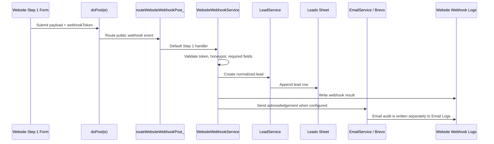
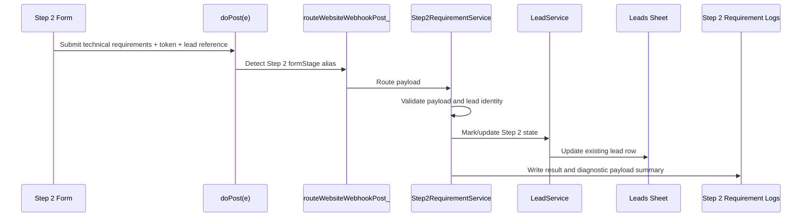
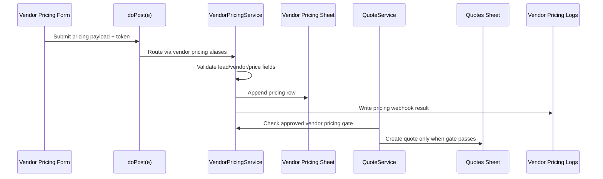

# MIDTS Automation Engine - Data Flow Map

Status: Stage 4 documentation-only operational intelligence. This document traces current data movement and does not authorize functional changes.

## Flow Overview

Primary lifecycle flow:

```text
Website Form
-> doPost(e)
-> webhook routing
-> token/honeypot/payload validation
-> lead creation
-> lead qualification / Step 2
-> acknowledgement and follow-up email paths
-> vendor assignment
-> vendor pricing
-> quote creation
-> quote status progression
-> project creation
-> payment tracking
-> Drive access
-> audit and dashboard visibility
```

Not every lead reaches every stage. Gates intentionally stop progression when required state is missing or unsafe.

## End-To-End Flow Matrix

| Stage | Source | Transformation | Validation | Destination | Audit trail | Rollback risk | Downstream dependency risk |
|---|---|---|---|---|---|---|---|
| Website form submission | Website Step 1 form | Browser payload becomes Apps Script POST body | Web app reachability, token, honeypot, required fields | `doPost(e)` | Apps Script execution record, `Website Webhook Logs` when handler runs | Low if rejected before mutation; higher if partial log/write occurs | No lead means no Step 2, vendor, quote, or project path |
| Webhook routing | `doPost(e)` | Payload parsed and route selected by form stage aliases | Route alias detection and payload parse success | Step 1, Step 2, or vendor pricing service | Service-specific log sheet or error log | Wrong route can mutate wrong sheet or create wrong lifecycle state | Misrouting can block or corrupt downstream workflow |
| Step 1 validation | `WebsiteWebhookService` | Normalizes name/email/company/project/message/source/page URL | `WEBSITE_WEBHOOK_TOKEN`, honeypot, required field rules | `LeadService` | `Website Webhook Logs`, `Error Logs` on failure | Lead may not exist; bad acceptance creates low-quality lead | Lead ID becomes anchor for all later state |
| Lead creation | `LeadService` | Creates lead ID and lifecycle defaults | Required lead fields, ID generation, sheet availability | `Leads` | `Website Webhook Logs`, possible `Email Logs` after acknowledgement | Duplicate/bad lead rows require manual sheet correction | Step 2, quote, vendor, project depend on lead row integrity |
| Acknowledgement email | `sendWebsiteLeadAcknowledgement_` -> `EmailService` | Lead data becomes Brevo email request | Brevo settings, recipient email, sender config | Brevo API and `Email Logs` | `Email Logs`, `Error Logs` on failure | Usually communication-only risk if lead already exists | Client may not receive next-step instructions |
| Step 2 link preparation | Email/form workflow | Lead identity and form URL become client Step 2 link | `STEP2_FORM_BASE_URL`, lead identifier availability | Client email/link | `Email Logs` if email is sent | Broken link requires resend/correction | Step 2 completion delayed; quote remains blocked |
| Step 2 submission | Client Step 2 form | Technical requirement payload becomes POST body | Token, route alias, existing lead lookup, required technical data | `Step2RequirementService` | Apps Script execution, `Step 2 Requirement Logs` | Updating wrong lead is high risk; rejected payload is lower risk | Quote readiness depends on accurate Step 2 state |
| Step 2 lead update | `Step2RequirementService` | Technical fields, score/readiness markers, Step 2 completion state applied to lead | Existing lead, qualification rules, sheet write success | `Leads` | `Step 2 Requirement Logs`, `Error Logs` | Manual correction may be required if wrong lead updated | Vendor/quote/project gates read this state |
| Lead qualification | `LeadService` | Lead score/status/readiness calculated or persisted | Required qualification criteria and Step 2 completion | `Leads` | Runner proof and lead row state | Incorrect qualification can release or block quote flow | Quote and vendor assignment depend on qualified state |
| Vendor assignment | `VendorService` | Qualified lead matched to eligible vendor | Vendor approval, status, NDA/ID, capability, lead readiness | `Vendors`, `Leads`, email path | Email logs and runner proof | Wrong vendor assignment affects pricing, privacy, and Drive access | Vendor pricing and project creation depend on assignment |
| Vendor pricing request email | `VendorService` -> `EmailService` | Sanitized lead snapshot and pricing URL become vendor email | `VENDOR_PRICING_FORM_BASE_URL`, vendor email, Brevo config | Brevo API, vendor inbox | `Email Logs` | Vendor may not receive request; wrong recipient is high risk | Pricing not received; quote remains blocked |
| Vendor pricing submission | Vendor pricing form | Vendor pricing payload becomes POST body | Token, route alias, lead/vendor linkage, required price fields | `VendorPricingService` | `Vendor Pricing Logs` | Wrong linkage can corrupt quote economics | Quote creation depends on correct pricing data |
| Vendor pricing record | `VendorPricingService` | Pricing data stored and optionally marked for approval/review | Required fields, lead/vendor lookup, approval rules | `Vendor Pricing` | `Vendor Pricing Logs`, `Error Logs` | Manual review/correction needed if cost or linkage wrong | Quote pricing and margin depend on this row |
| Quote creation | `QuoteService` | Qualified lead and approved vendor pricing become quote row | Step 2 complete, qualified lead, approved vendor pricing, quote gate | `Quotes` | Stage 3 runner evidence, `Error Logs` | Bad quote row affects customer commercial record | Project and payment require quote state |
| Quote status progression | `QuoteService` | Quote status changes through allowed lifecycle | Valid current status and allowed transition | `Quotes` | Runner proof / sheet state | Invalid transition can release downstream work incorrectly | Project creation and payment depend on accepted/valid quote |
| Project creation | `ProjectService` | Qualified lead, eligible vendor, accepted quote become project row | Lead/quote/vendor gates | `Projects` | Stage 4 runner evidence, `Error Logs` | Premature project creation requires manual cleanup | Drive and payment workflows depend on project row |
| Payment tracking | `PaymentService` | Accepted quote becomes payment record/status | Accepted quote, payment sheet availability | `Payments` | Stage 5 runner evidence | Payment status may misstate financial readiness | Project/payment reporting and lifecycle gates affected |
| Drive folder/access | `DriveService` | Project/vendor state becomes Drive folder/access permissions | `ROOT_DRIVE_FOLDER_ID`, vendor eligibility, project assignment | Google Drive, `Drive Access Logs`, `Projects` | `Drive Access Logs`, Stage 6 runner evidence | Unauthorized access or missing access is high operational risk | Vendor execution depends on access correctness |
| Dashboard visibility | `DashboardService` | Sheet records become metrics/recent rows | Sheet availability and expected headers | Apps Script dashboard | Stage 9 validation | Mostly read-only; wrong visibility can mislead operators | Decisions may be made from stale/wrong metrics |
| Error/audit logging | Services and `ErrorLogger` | Exceptions/results become log rows | Log sheet availability | Log sheets | `Error Logs` plus service logs | Missing audit trail slows incident response | Future changes lose proof and diagnosis |

## Public Intake Flow



## Step 2 Qualification Flow



## Vendor Pricing To Quote Flow



## State Anchors

| Anchor | Created by | Used by | Why it matters |
|---|---|---|---|
| Lead ID | `LeadService` / `UtilsService` | Step 2, vendor pricing, quote, project, payment, dashboard | Primary lifecycle identity |
| Quote ID | `QuoteService` / `UtilsService` | Project and payment workflows | Commercial approval identity |
| Project ID | `ProjectService` / `UtilsService` | Drive and execution workflows | Delivery execution identity |
| Vendor ID/email | `VendorService` / `Vendors` sheet | Vendor pricing and Drive access | Vendor assignment and access identity |
| Settings keys | `Settings` / `ConfigService` | Webhooks, email, Slack, Drive, form links | Runtime configuration identity |
| Audit log rows | Service log writers | Operators, governance docs, incident review | Evidence and troubleshooting identity |

## Validation And Audit Data Flow

Runner flows are not normal customer lifecycle traffic, but they intentionally create or inspect data to prove behavior.

| Runner area | Writes state? | Audit path | Main risk |
|---|---|---|---|
| Setup validation | Usually read-only or sheet/header validation | Console result and sometimes log rows | False confidence if not matched to current sheet state |
| Payload tests | Yes, test leads/log rows/pricing rows may be created | Matching service log sheet | Test data can be mistaken for production data |
| Email tests | Yes, `Email Logs`; may send real test email | `Email Logs` and Brevo response | Wrong test recipient or live email misfire |
| Drive tests | Yes, Drive folder/access logs may change | `Drive Access Logs` | Access changes must be controlled |
| Dashboard tests | Primarily read-only | Dashboard validation result | Bad dashboard can hide operational state |

## Rollback Risk Scale

| Risk | Meaning | Examples |
|---|---|---|
| Low | Rejected before mutation or docs/read-only only | Invalid token rejected; dashboard read failure |
| Medium | Audit or secondary communication affected | Slack alert missing; email log missing |
| High | Core lifecycle row mutated incorrectly | Wrong lead update; wrong quote status; bad vendor pricing |
| Critical | Security, access, deployment, or primary identity affected | Wrong Drive access; wrong Apps Script project; duplicate IDs; sheet schema damage |

## Downstream Dependency Hotspots

- `Leads` is the central dependency for Step 2, quote, vendor, project, payment, email, and dashboard flows.
- `WEBSITE_WEBHOOK_TOKEN` protects all public webhook entry points.
- `Vendor Pricing` is a quote prerequisite.
- `Quotes` is a project/payment prerequisite.
- `Vendors` controls assignment and Drive access safety.
- `Settings` controls email, Slack, Drive, webhook token, and form link behavior.
- `Email Logs`, webhook logs, and `Error Logs` are required for diagnosis when a flow appears silent.

## Data Flow Control Note

This document is descriptive. If a future change alters any source, transformation, validation, destination, audit trail, or gate listed here, the PR must update this map and provide the matching runner proof.